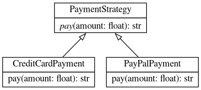

# Architektura systemu

Diagram klas wygenerowany automatycznie z kodu źródłowego przez narzędzie `pyreverse`
w ramach potoku CI/CD. Odzwierciedla aktualną strukturę modułu płatności.

## Diagram klas — Wzorzec Strategii

!!! info "Wzorzec Strategii"
    Wzorzec **Strategy** pozwala zdefiniować rodzinę algorytmów, enkapsulować
    każdy z nich i uczynić je wymiennymi. Algorytm może się zmieniać niezależnie
    od klientów, które z niego korzystają.

    - `PaymentStrategy` — abstrakcyjna klasa bazowa definiująca kontrakt
    - `CreditCardPayment` — implementacja płatności kartą kredytową
    - `PayPalPayment` — implementacja płatności przez PayPal

!!! warning "Diagram niedostępny lokalnie"
    Plik `diagrams/classes_payment.png` jest generowany automatycznie podczas
    uruchomienia GitHub Actions. Lokalnie diagram nie będzie widoczny do czasu
    ręcznego uruchomienia `pyreverse -o png -p payment src/python/pattern.py`.
