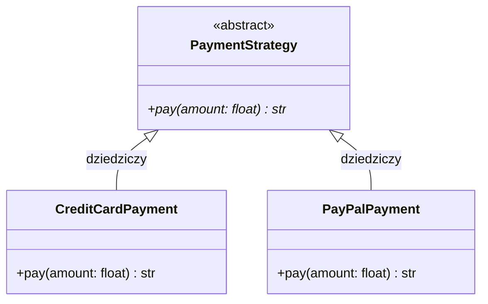

# Architektura systemu

Poniżej znajduje się diagram klas odwzorowujący strukturę wzorca projektowego **Strategia** (Strategy),
zaimplementowanego w module płatności.

## Diagram klas — Wzorzec Strategii

!!! info "Wzorzec Strategii"
    Wzorzec **Strategy** pozwala zdefiniować rodzinę algorytmów, enkapsulować każdy z nich
    i uczynić je wymiennymi. Dzięki temu algorytm może się zmieniać niezależnie od klientów, które z niego korzystają.

    - `PaymentStrategy` — abstrakcyjna klasa bazowa definiująca kontrakt
    - `CreditCardPayment` — implementacja płatności kartą kredytową
    - `PayPalPayment` — implementacja płatności przez PayPal
